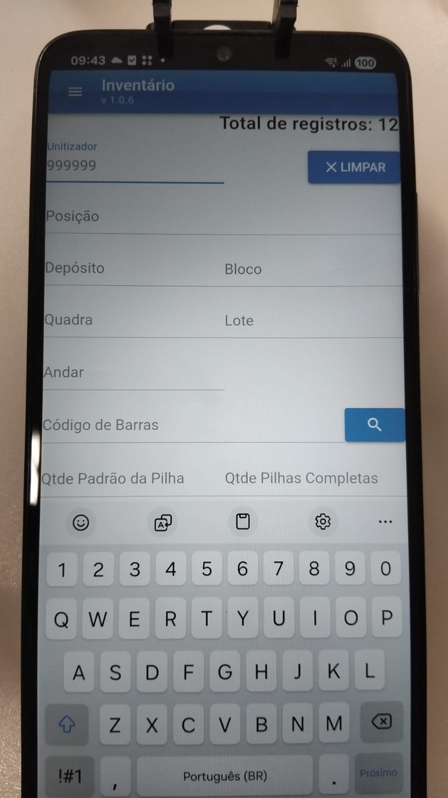

# Oxford App Connector Inv - Aplicativo de Inventário

Aplicativo Android desenvolvido usando o Quasar framework (ou Quasar.js), um framework de código aberto baseado na biblioteca Vue.js

<table align="center" width="100%">
  <tr>
    <td align="center" width="25%" valign="top">
      <h3>Principal</h3>
      
    </td>
  </tr>
</table>

Abaixo o passo a passo para criar um ambiente local usando o Docker, poder executar a aplicação localmente e testar via Web ou publicar uma nova versão do APK de instalação para Android.

## Crie o arquivo Dockerfile na raiz do projeto:

```bash
FROM beevelop/cordova:latest

# Define o diretório de trabalho dentro do container
WORKDIR /app

# Copia os arquivos de mapeamento de dependências
COPY package*.json ./

RUN npm install --legacy-peer-deps --no-audit --no-fund

# Copia o restante do código fonte
COPY . .

# Expõe as portas padrão do Quasar
EXPOSE 8080 8081

# Comando padrão ao iniciar o container
CMD ["/bin/bash"]
```

---

## Construa a Imagem Docker

```bash
docker build -t oxford-app-connector-inv .
```

## Inicie o Container em Modo Interativo

```bash
docker run -it --name oxford-app-connector-inv-rodando -p 8080:8080 -v "${PWD}:/app" oxford-app-connector-inv
```

---

---

# Para rodar o app pelo browser para testar:

### No terminal do Docker (que ficou aberto no passo anterior) execute os comandos:

- 1. Instala o gerenciador de versões "n" globalmente:

```bash
npm install -g n
```

- 2. Força o download e o uso do Node 12 (compatível com seu Quasar):

```bash
n 12
```

- 3. Atualiza o terminal para reconhecer o Node antigo:

```bash
hash -r
```

- 4. Instala o CLI antigo globalmente de forma rápida:

```bash
npm install -g quasar-cli@0.17.26
```

- 5. Apaga a pasta gerada incorretamente:

```bash
rm -rf node_modules
```

- 6. Reinstala com o Node correto:

```bash
npm install --legacy-peer-deps
```

- 7. Inicia o modo de teste no browser:

```bash
quasar dev --host 0.0.0.0 --port 8080
```

---

---

# Para gerar o APK do Android:

### No terminal do Docker (que ficou aberto no passo anterior) execute o comando do Quasar para gerar o APK:

- Crie a estrutura do Cordova

```bash
npm install -g cordova@10.0.0 --unsafe-perm # Executar essa linha apenas se o diretorio src-cordova nao existir
quasar mode --add cordova
```

- Acesse a pasta src-cordova e verifique/adicione a plataforma Android:

```bash
cd src-cordova
cordova platform add android
cd ..
```

- Instalar o OpenJDK 8

```bash
apt-get update
apt-get install -y openjdk-8-jdk
```

- Definir a variável JAVA_HOME para o Java 8

```bash
export JAVA_HOME=/usr/lib/jvm/java-8-openjdk-amd64
export PATH=$JAVA_HOME/bin:$PATH
```

- Confirmar a versão ativa do Java A saída deve ser algo semelhante a openjdk version "1.8.0\_..."

```bash
java -version
```

- Compile o app com o comando quasar

```bash
quasar build -m cordova -T android --debug
```

- Ou, se quiser gerar o APK diretamente com o Cordova

```bash
cd src-cordova
cordova build android
cd ..
```

- Instale o editor nano dentro do Docker para poder editar os arquivos abaixo

```bash
apt-get update && apt-get install -y nano
```

- Abra o seguinte arquivo pelo terminal

```bash
nano /app/src-cordova/platforms/android/repositories.gradle
```

- Substitua todos os lugares onde aparece jcenter() por mavenCentral()
- No editor do nano: Ctrl + O, Depois Enter (para salvar) , Depois Ctrl + X (para sair)
- Repita o mesmo com o outro arquivo abaixo:

```bash
nano /app/src-cordova/platforms/android/app/repositories.gradle
```

- Crie uma regra de redirecionamento global no Gradle, execute todo o comando abaixo:

```bash
mkdir -p /root/.gradle && cat << 'EOF' > /root/.gradle/init.gradle
allprojects {
    buildscript {
        repositories {
            mavenCentral()
            google()
        }
        configurations.all {
            resolutionStrategy.eachDependency { DependencyResolveDetails details ->
                // Remove travas de repositórios fantasmas
            }
        }
    }
    repositories {
        mavenCentral()
        google()
    }
}

gradle.projectsLoaded {
    rootProject.allprojects {
        repositories {
            all { ArtifactRepository repo ->
                if (repo instanceof MavenArtifactRepository && repo.url.toString().contains("jcenter.bintray.com")) {
                    project.logger.lifecycle("Redirecionando JCenter para MavenCentral em: ${repo.url}")
                    repo.url = "https://maven.org"
                }
            }
        }
        buildscript.repositories {
            all { ArtifactRepository repo ->
                if (repo instanceof MavenArtifactRepository && repo.url.toString().contains("jcenter.bintray.com")) {
                    project.logger.lifecycle("Redirecionando JCenter para MavenCentral no buildscript em: ${repo.url}")
                    repo.url = "https://maven.org"
                }
            }
        }
    }
}
EOF
```

- Force o Gradle a limpar o Cache e Recompilar

```bash
cd src-cordova
cordova build android --debug -- --no-daemon --refresh-dependencies
cd ..
```

- Substitua fisicamente todas as ocorrências de JCenter por MavenCentral:
- Executa a substituição nos arquivos gradle da plataforma

```bash
find /app/src-cordova/platforms/android/ -type f \( -name "*.gradle" -o -name "*.properties" \) -exec sed -i 's|jcenter()|mavenCentral()|g' {} +
find /app/src-cordova/platforms/android/ -type f \( -name "*.gradle" -o -name "*.properties" \) -exec sed -i 's|https://jcenter.bintray.com/|https://maven.org|g' {} +
```

- Remova o script temporário para não dar conflito

```bash
rm -f /root/.gradle/init.gradle
```

- Remove pastas de cache locais do compilador

```bash
rm -rf /app/src-cordova/platforms/android/.gradle
rm -rf /app/src-cordova/platforms/android/app/build
rm -rf /root/.gradle/caches
```

- Execute o build

```bash
cd src-cordova
cordova build android --debug -- --no-daemon
cd ..
```

- Abra o arquivo de configuração interna do Cordova

```bash
nano /app/src-cordova/platforms/android/CordovaLib/cordova.gradle
```

- Logo nas primeiras linhas do arquivo, procure pela linha: import com.g00fy2.versioncompare.Version e altere para import io.github.g00fy2.versioncompare.Version
- substitua a linha classpath 'com.g00fy2:versioncompare:1.3.4@jar' por classpath 'io.github.g00fy2:versioncompare:1.5.0'
- No editor do nano: Ctrl + O, Depois Enter (para salvar) , Depois Ctrl + X (para sair)

- Abra o arquivo de build do CordovaLib

```bash
nano /app/src-cordova/platforms/android/CordovaLib/build.gradle
```

- Comente ou delete as linhas do Bintray (linha 40 classpath 'com.jfrog.bintray.gradle:gradle-bintray-plugin:1.7.3' - linha 51 apply plugin: 'com.jfrog.bintray' - bloco da linha 129 a 150 bintray {....} )
- Salva e saia do editor: aperte Ctrl + O, depois Enter e Ctrl + X

- Remove pastas de cache locais do compilador

```bash
rm -rf /app/src-cordova/platforms/android/.gradle
rm -rf /app/src-cordova/platforms/android/app/build
rm -rf /root/.gradle/caches
```

- Execute o build

```bash
cd src-cordova
cordova build android --debug -- --no-daemon
cd ..
```

- Aponta temporariamente para o Java 17 nativo da imagem

```bash
update-alternatives --set java /usr/lib/jvm/java-17-openjdk-amd64/bin/java
```

- Executa o aceitador de licenças (agora vai funcionar direto)

```bash
yes | JAVA_HOME=/usr/lib/jvm/java-17-openjdk-amd64 sdkmanager --licenses
```

- Retorna para o Java 8 exigido pelo seu Gradle de 2018

```bash
update-alternatives --set java /usr/lib/jvm/java-8-openjdk-amd64/jre/bin/java
```

- Cria o arquivo simulador do 'dx' apontando para o novo compilador 'd8'

```bash
ln -s /opt/android/build-tools/36.0.0/d8 /opt/android/build-tools/36.0.0/dx
```

- Remove pastas de cache locais do compilador

```bash
rm -rf /app/src-cordova/platforms/android/.gradle
rm -rf /app/src-cordova/platforms/android/app/build
rm -rf /root/.gradle/caches
```

- Execute o build

```bash
cd src-cordova
cordova build android --debug -- --no-daemon
cd ..
```

- Apaga a pasta da versão incompatível do Android Build Tools

```bash
rm -rf /opt/android/build-tools/36.0.0
rm -rf /opt/android/build-tools/34.0.0
```

- Baixa as ferramentas de compilação da versão 29

```bash
JAVA_HOME=/usr/lib/jvm/java-17-openjdk-amd64 sdkmanager "build-tools;29.0.2" "platforms;android-29"
```

- Garante que o arquivo de propriedades use estritamente a API 29

```bash
sed -i 's/cdvCompileSdkVersion=.*/cdvCompileSdkVersion=29/g' /app/src-cordova/platforms/android/project.properties
sed -i 's/cdvBuildToolsVersion=.*/cdvBuildToolsVersion=29.0.2/g' /app/src-cordova/platforms/android/project.properties
```

- Remove pastas de cache locais do compilador

```bash
rm -rf /app/src-cordova/platforms/android/.gradle
rm -rf /app/src-cordova/platforms/android/app/build
rm -rf /root/.gradle/caches
```

- Execute o build

```bash
cd src-cordova
cordova build android --debug -- --no-daemon
cd ..
```

- O APK deve ser gerado em \app\src-cordova\platforms\android\app\build\outputs\apk\debug

---

# Use o comando do Quasar para o Build debug/ não assinado para instalar via celular:

```bash
quasar build -m cordova -T android --debug
```

### Ou release / assinado:

```bash
quasar build -m cordova -T android
```

### Ou para compilar usando diretamente o Cordova:

```bash
cd src-cordova
cordova build android --debug -- --no-daemon
cd ..
```

---

# Se quiser localizar o arquivo .apk pela extensao, caso não esteja encontrando:

```bash
find /app -name "*.apk"
```

---

# Parar o container atual:

- No terminal do seu Docker, aperte Ctrl + C para derrubar o servidor Quasar. Depois, digite exit para sair do container.

---

# Destruindo o Ambiente (Limpeza Total):

- Para parar e remover o container que foi executado:

```bash
docker rm -f oxford-app-connector-inv-rodando
```

- Para deletar a imagem de build (liberando espaço em disco):

```bash
docker rmi oxford-app-connector-inv
```

---
